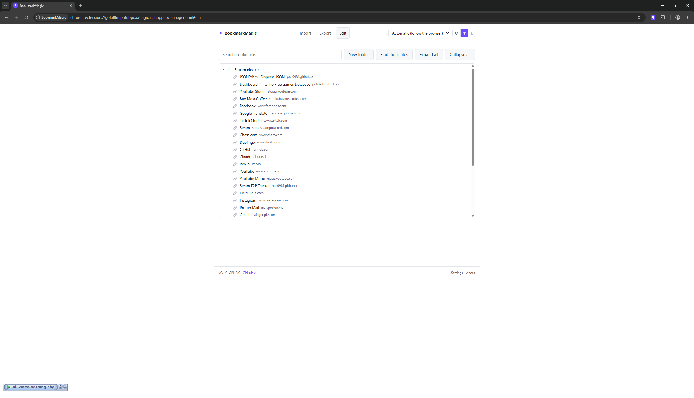
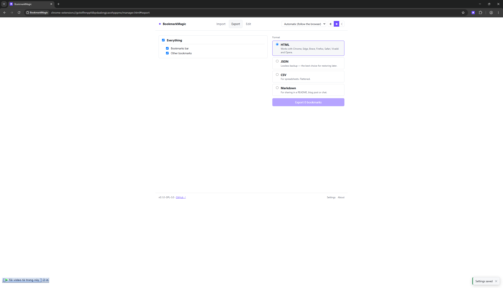
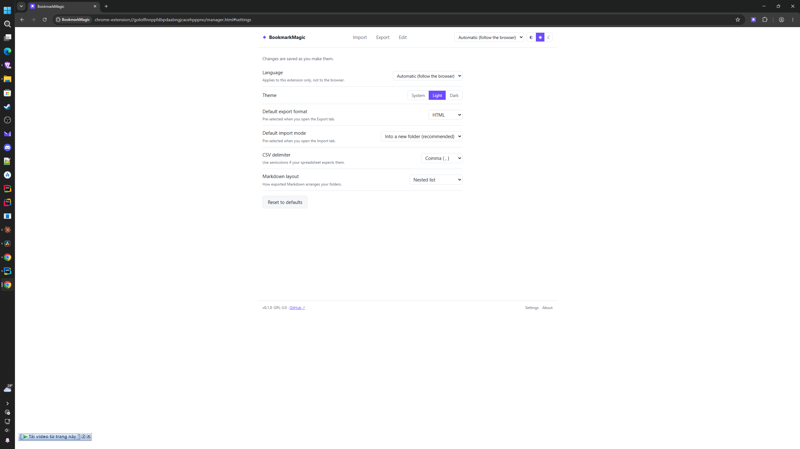
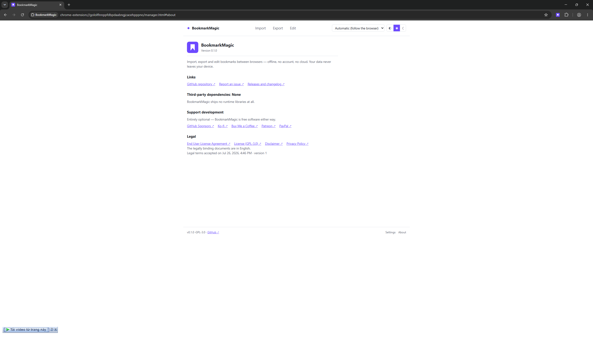

# BookmarkMagic

[](LICENSE)
[](https://github.com/poli0981/bookmarkmagic/actions/workflows/ci.yml)
[](https://github.com/poli0981/bookmarkmagic/actions/workflows/codeql.yml)
[](#privacy)

Move your bookmarks between browsers the simple way: with a file. No account,
no cloud sync, 100% offline.

A Chrome (MV3) extension for importing, exporting and editing bookmarks and
folder trees. English · Tiếng Việt · 日本語.

## Screenshots

| Edit | Export |
|---|---|
|  |  |

| Settings | About |
|---|---|
|  |  |

## What it does

- **Import** HTML, JSON or CSV bookmark files, with a full preview first —
  counts, folders, depth, duplicates and warnings before anything is written.
- **Choose how**: into a new dated folder (the safe default), merged into your
  existing folders, or replacing everything. Replace saves a JSON safety backup
  first and **deletes nothing until that backup is proven**.
- **Export** everything, or just the folders you pick, to HTML (Chrome, Edge,
  Brave, Firefox, Safari, Vivaldi, Opera), JSON, CSV or Markdown.
- **Edit** the tree: search, rename, drag & drop, create folders, delete, and
  find duplicate links — every action reachable from the keyboard.

## Privacy

This is the whole point of the project, so it is worth being precise.

- **No network access at all.** Not analytics, not telemetry, not update pings.
  There is no server. A grep gate (`npm run guard`) fails the build if anyone
  adds `fetch`, `XMLHttpRequest`, `WebSocket`, `EventSource` or `sendBeacon`.
- **Exactly two permissions**: `bookmarks` and `storage`. No host permissions,
  no content scripts, no background worker. Two gates enforce it: a unit test
  over `wxt.config.ts`, and `npm run check:manifest`, which CI runs against the
  **built** `manifest.json` — because a build can add what the config never
  asked for.
- **Zero runtime dependencies.** Nothing third-party ships in the extension.
- Settings use `chrome.storage.local`, never `storage.sync`, so even your
  preferences stay off any vendor cloud.

Full policy: [`legal/PRIVACY.md`](legal/PRIVACY.md).

## Honest limitations

- Favicons cannot be imported — the bookmarks API has no favicon field.
- Imported bookmarks get today's date. Chrome does not let an extension set a
  bookmark's original creation date. Your **exported** files keep the real ones.
- CSV is a flattened view: empty folders and "which folder is the toolbar" are
  not preserved. Use HTML or JSON for a faithful backup.
- Markdown is share-only — BookmarkMagic cannot read it back.

## Install

From the Chrome Web Store: [here](https://chromewebstore.google.com/detail/bookmarkmagic/eghnciphhegekmnofffpgbdfefckdhmg)

From source:

```bash
npm ci && npm run build
```

Then load `.output/chrome-mv3/` at `chrome://extensions` with Developer mode on.

## Development

```bash
npm run dev
```

`npm run verify` is the gate everything else answers to — lint, type-check,
knip, the grep gate and the test suite, in that order. It must be green before
every commit.

The [`docs/`](docs/) directory is the binding specification, not notes: where
code and docs disagree, the docs win. Start with [`CLAUDE.md`](CLAUDE.md), then
`docs/00`–`docs/02`.

## Contributing

Bug reports and translation fixes are welcome —
[the issue forms](https://github.com/poli0981/bookmarkmagic/issues/new/choose)
ask for what is needed, and none of them requires you to write code.

If a bookmark file will not import, that is the most useful report there is,
because the sample becomes a permanent test. Sanitize it first:

```bash
node scripts/sanitize-bookmarks.mjs your-bookmarks.html
```

That strips every address and title but keeps the structure, encoding and
timestamps a parser bug depends on — so the sanitized file still reproduces the
problem without handing over your browsing history.

[`CONTRIBUTING.md`](CONTRIBUTING.md) has the rest: the setup, the rules that are
not negotiable, and how a reported file becomes a regression test.

Security issues: please follow [`SECURITY.md`](SECURITY.md) rather than opening
a public issue.

## Support development

Entirely optional — BookmarkMagic is free software either way.

[GitHub Sponsors](https://github.com/sponsors/poli0981) ·
[Ko-fi](https://ko-fi.com/skullmute) ·
[Buy Me a Coffee](https://www.buymeacoffee.com/skullmute) ·
[Patreon](https://www.patreon.com/skullmute) ·
[PayPal](https://paypal.me/DungDang212)

## Licence

[GPL-3.0-or-later](LICENSE). Also see [`legal/EULA.md`](legal/EULA.md),
[`legal/DISCLAIMER.md`](legal/DISCLAIMER.md) and
[`legal/THIRD_PARTY_NOTICES.md`](legal/THIRD_PARTY_NOTICES.md).

Not affiliated with or endorsed by Google, Chrome, or any browser vendor.
Browser names are trademarks of their respective owners.
